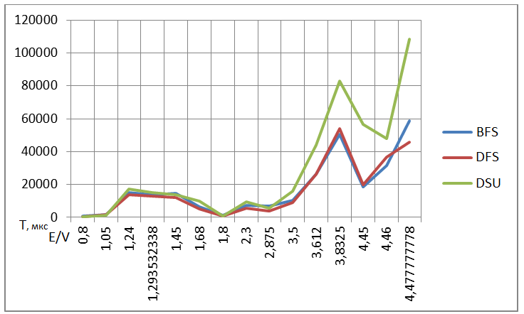
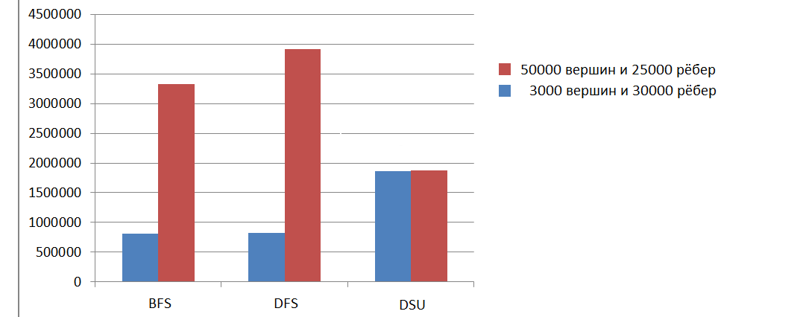

## Результаты

### Сравнение по памяти
Все три алгоритма по памяти требуют O(|E|+|V|) памяти. Но для алгоритмах основанным на поиске в ширину и глубину требуется хранение графа, тоесть нам обязательно нужно хранить граф в памяти программы, в то время как алгоритме, использующий dsu, нам нужны лишь ребра графа, и поэтому мы можем в online режиме,прямо во время подачи данных из источника считывать их и сразу передавать в dsu, в которой в итоге буду хранится только вершины графа и память будет занимать O(|V|).
### Сравнение по скорости.

Таким образом можно сделать вывод, что при большом количесвте вершин в графе и малом количестве рёбер, лучше использовать систему непересекающихся множеств, но если в графе ребер во много раз больше чем вершин, то лучше использовать алгоритм основанный на обходе в ширину или глубину(так как они показали себя одинаково).
