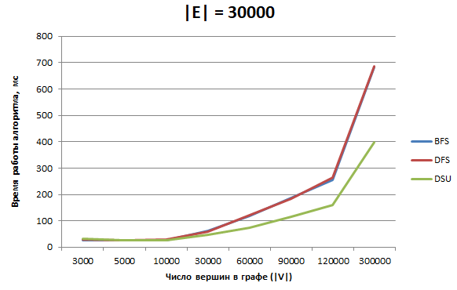

## Результаты

### Сравнение по памяти
Все три алгоритма по памяти требуют O(|E|+|V|) памяти. Но для алгоритмах основанным на поиске в ширину и глубину требуется хранение графа, тоесть нам обязательно нужно хранить граф в памяти программы, в то время как алгоритме, использующий dsu, нам нужны лишь ребра графа, и поэтому мы можем в online режиме, прямо во время подачи данных из источника считывать их и сразу передавать в dsu, в которой в итоге буду хранится только вершины графа и память будет занимать O(|V|).
### Сравнение по скорости.

1 эксперимент:  |V| = 300000, |E| = 0;
2 эксперимент:  |V| = 270000, |E| = 30000;
3 эксперимент:  |V| = 250000, |E| = 50000;
4 эксперимент:  |V| = 200000, |E| = 100000;
5 эксперимент:  |V| = 150000, |E| = 150000;
6 эксперимент:  |V| = 100000, |E| = 200000;
7 эксперимент:  |V| = 50000,  |E| = 249970;
8 эксперимент:  |V| = 30000,  |E| = 269920;
9 эксперимент:  |V| = 10000,  |E| = 289191;
10 эксперимент: |V| = 5000,   |E| = 291499;
11 эксперимент: |V| = 1000,   |E| = 224531;
Таким образом можно сделать вывод, что при большом количесвте вершин в графе и малом количестве рёбер(граф разряженный), лучше использовать систему непересекающихся множеств, если граф сильно связный (число рёбер во много раз больше числа вершин), то все алгоритмы работают примерно за одинаковое время.
Относительная погрешность измерений при замере времени составила 9,5 %.
Для повышения точности измерений можно увеличить число замеров времени в одном эксперименте(с 4 до 10 например), а так же проводить вычисления на графах с большим количеством вершин и ребер ( |V| + |E| примерно  > 10000), для минимизации приборной погрешности.
