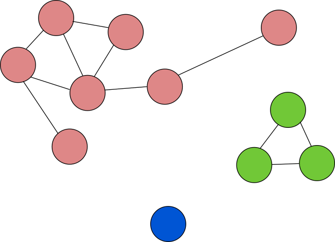

# Теоретическая часть 

## Условие задачи
Сравните производительность алгоритмов разбиения графов на
компоненты связности, основанные на различных алгоритмах поиска
(например, BFS), и алгоритма, использующего систему
непересекающихся множеств (DSU).).
## Подходы к решению задачи
###  Теория

Компонента связности графа ***G*** (или просто компонента графа ***G***) — максимальный (по включению) связный подграф графа ***G***.

#### Известные подходы к решению задачи:

#### Обход графа методам BFS.
Поиск в ширину (англ. *breadth-first search*, **BFS**) — метод обхода графа.
Поиск в ширину работает путём последовательного просмотра отдельных уровней графа, начиная с узла-источника ***u***.

**Алгоритм:** Рассмотрим все рёбра ***(u,v)***, выходящие из узла ***u***. Если очередной узел ***v*** является целевым узлом, то поиск завершается; в противном случае узел ***v*** добавляется в очередь. После того, как будут проверены все рёбра, выходящие из узла  ***u***, из очереди извлекается следующий узел  ***u***, и процесс повторяется.

**Пространственная сложность:**  Так как в памяти хранятся все развёрнутые узлы, пространственная сложность алгоритма составляет ***O(V + E)***.

**Временная сложность:** Так как в худшем случае алгоритм посещает все узлы графа, при хранении графа в виде списков смежности, временная сложность алгоритма составляет ***O(V + E)***.

**Достоинства:** Работает за линейное время, затраты по памяти линейны, простой алгоритм в реализации.

**Недостатки:**Подходит в чистом виде только для нахождения слабых компонент связности.

#### Обход графа методам DFS.
Поиск в глубину (англ. *Depth-first search*, **DFS**) — один из методов обхода графа.

**Алгоритм:** Алгоритм поиска описывается рекурсивно: перебираем все исходящие из рассматриваемой вершины рёбра. Если ребро ведёт в вершину, которая не была рассмотрена ранее, то запускаем алгоритм от этой нерассмотренной вершины, а после возвращаемся и продолжаем перебирать рёбра. Возврат происходит в том случае, если в рассматриваемой вершине не осталось рёбер, которые ведут в нерассмотренную вершину. Если после завершения алгоритма не все вершины были рассмотрены, то необходимо запустить алгоритм от одной из нерассмотренных вершин.

**Пространственная сложность:**  Так как в памяти хранятся все развёрнутые узлы, пространственная сложность алгоритма составляет ***O(V + E)***.

**Временная сложность:** Так как в худшем случае алгоритм посещает все узлы графа, при хранении графа в виде списков смежности, временная сложность алгоритма составляет ***O(V + E)***.

**Достоинства:** Работает за линейное время, затраты по памяти линейны, простой алгоритм в реализации.

**Недостатки:** Подходит в чистом виде только для нахождения слабых компонент связности, .

#### Система непересекающихся множеств

**Система непересекающихся множеств** (англ. *disjoint-set,* или *union–find data structure*) — структура данных, которая позволяет администрировать множество элементов, разбитое на непересекающиеся подмножества. При этом каждому подмножеству назначается его представитель — элемент этого подмножества. Абстрактная структура данных определяется множеством трёх операций: *Union*, *Find*, *MakeSet*.

Пусть ___S___ конечное множество, разбитое на непересекающиеся подмножества (классы) ***Xi***:

Каждому подмножеству ***Xi*** назначается представитель . Соответствующая система непересекающихся множеств поддерживает следующие операции:

-  создаёт для элемента ***x*** новое подмножество. Назначает этот же элемент представителем созданного подмножества.
- : объединяет оба подмножества, принадлежащие представителям ***r*** и ***s***, и назначает **r** представителем нового подмножества.
- : определяет для  подмножество, к которому принадлежит элемент, и возвращает его представителя.

Для ускорения операций Union и Find могут быть использованы эвристики  сжатия пути и объединения по рангу при совместном применении эвристик сжатия пути и объединения по рангу время работы на один запрос получается  в среднем , где  — обратная функция Аккермана, 

**Достоинства:** Позволяет хранить компоненты связности, не требует реализации графа, быстрое время работы.

**Недостатки:** Реализация без эвристик делает структуру данных менее эффективной, операции Find и Union работают за линейное время.

### Формальная постановка задачи

Необходимо реализовать: граф для хранения его структуры, реализовать структуру данных "система непересекающихся множеств" с эвристиками сжатия пути и объединения по рангу, три алгоритма поиска компонент, основанных на обходе в глубину, ширину, и на системе неперескающихся множеств, сравнить алгоритмы по производительности.

## Выбор алгоритма
По заданию требутся сравнить алгоритмы разбиения графов на
компоненты связности, основанные на различных алгоритмах поиска (обход в ширину и глубину), и алгоритма, использующего систему
непересекающихся множеств. Поэтому выбраны три алгоритма: 2 основанны на обходе в глубину и ширену, и последний основан на системе неперескающихся множеств.
